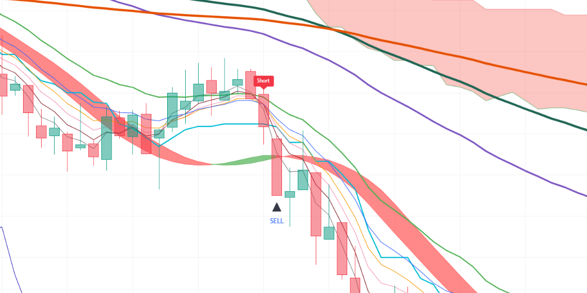

# Pine-Script-JH3-Multi-Timeframe-Strategy-Indicator
Indicator based on multi-timeframe EMA ribbons (1m, 2m, 3m), 2-minute RSI alignment, 1-minute MACD zero-line momentum, Ichimoku Conversion Line, Hull Suite, and higher-timeframe session anchors with a modular "Use" toggle architecture. Signals entry for long/short on 3-minute cryptocurrency charts on TradingView.
--
## Chart Preview

--
## Motivation & Problem
- **Suboptimal Filter Stacks & Multi-Timeframe Blindspots**: Traditional single-timeframe strategies often produce false breakout signals during lower-timeframe chop or lag behind momentum shifts because they lack synchronized alignment across micro-timeframes.
- **The Core Goal**: To build a comprehensive multi-factor trading system (JH3) that synchronizes 1m, 2m, and 3m EMA crossover momentum, enforces strict multi-length RSI ordering, and offers modular boolean "Use" switches to let traders activate or bypass individual technical filters dynamically.
--
## Strategy Logic & Architecture
- This indicator avoids false signals and wrong interpretation of the trend by utilizing a **rule-based, multi-factor filtering system**:
### Core Components:
1. **Multi-Tiered EMA Ribbons (1m, 2m, 3m)**:
  - Deploys a 10-period EMA ribbon (lengths 3, 5, 7, 9, 12, 20, 30, 60, 100, 200) monitored across three concurrent timeframes:
    - **3-Minute**: Fast EMAs (5, 7, 9) crossing EMA 20 ('To10CrossUp' / 'To10CrossDown').
    - **1-Minute**: Fast EMAs (5, 7, 9) crossing intermediate EMA 60 ('Min1EMACrossUp' / 'Min1EMACrossDown').
    - **2-Minute**: Fast EMAs (5, 7, 9) crossing baseline EMA 30 ('Min2EMACrossUp' / 'Min2EMACrossDown').
  - Includes a Hull Suite band (HMA 55, 240m HTF) to establish macro price direction ('AboveHull' / 'BelowHull').
2. **The "Use" Feature, Ordered RSI & MACD Momentum**:
  - Introduces dynamic boolean toggles ('UseEMA1to10', 'UseRSI', 'UseMACD', 'UseIchimoku', 'UseHullSuite') to toggle individual filters on or off without modifying code.
  - Pulls 2-minute RSI across 3 lengths (7, 9, 11) requiring strict sequential ordering ('RSI1 > RSI2 > RSI3') above 55 for longs or below 45 for shorts.
  - Evaluates 1-minute MACD zero-line crossing to guarantee underlying momentum aligns with the trade direction.
  - Checks 3-minute Ichimoku Conversion Line (Tenkan-sen) slope direction ('ConversionLineFacingUp' / 'Down').
3. **Execution Rule (3-Minute Timeframe)**:
  - **Bullish Signal**: Triggers on the 3m chart when 3m EMA crossover up occurs (if enabled) and 2m multi-length RSI is ordered above 55 (if enabled) and 1m MACD line is above zero (if enabled) and Ichimoku Conversion Line slopes upward (if enabled) and previous close is above Hull Suite (if enabled) and both 1m and 2m fast EMAs confirm bullish crossovers simultaneously.
  - **Bearish Signal**: Triggers on the 3m chart when 3m EMA crossover down occurs (if enabled) and 2m multi-length RSI is ordered below 45 (if enabled) and 1m MACD line is below zero (if enabled) and Ichimoku Conversion Line slopes downward (if enabled) and previous close is below Hull Suite (if enabled) and both 1m and 2m fast EMAs confirm bearish crossovers simultaneously.
  - **Exit Marker**: Plots a "SELL" triangular marker on the bar directly following a long or short entry signal.
4. **Session Open Anchors (1H & 1D Lines)**:
  - Tracks live opening prices of 1-Hour ('open1H') and 1-Day ('open1D') bars via 'request.security()'.
  - Renders single-segment horizontal rays with dynamic deletion ('line.delete(line1H[1])') to deliver persistent intraday reference benchmarks without chart clutter.
--
## Configurable Parameters
Users can adjust the following parameters inside TradingView's settings panel:
- **Time Frame Inputs**: Default - 1m, 2m, 3m. Lookback intervals for multi-timeframe calculations.
- **EMA Ribbon (Lengths 1-10)**: Default - 3, 5, 7, 9, 12, 20, 30, 60, 100, 200. Toggle switches for signal crossover evaluation ('UseEMA1to10'), global ribbon visualization ('PlotEMA1to10'), and optional EMA 30 display.
- **RSI Time Frame & Lengths**: Default - 2m timeframe, lengths 7, 9, 11. Overbought/oversold momentum thresholds (55 / 45) with 'UseRSI' toggle.
- **MACD Time Frames**: Default - 1m and 2m timeframes. Fast length 12, slow length 26, signal length 9 with 'UseMACD' zero-line filter toggle.
- **Ichimoku Settings**: Default - Conversion Line 9, Base Line 26, Leading Span B 52, Displacement 26. Toggles for visual plotting ('PlotIchimoku') and directional slope filtering ('UseIchimoku').
- **Hull Suite**: Default - HMA length 55, 240m HTF. Customizable modes (HMA, EHMA, THMA), band transparency, and 'UseHullSuite' filter toggle.
- **Time Mark (1H & 1D Anchors)**: Configurable line colors and widths for real-time 1-hour and 1-day opening price horizontal levels.
--
## How to Install & Use in TradingView
1. Open any crypto chart (e.g., `BTC/USDT`) on **[TradingView](https://www.tradingview.com/)**.
2. Open the **`Pine Editor`** console at the bottom of the page.
3. Open `This Pine Script® code is subject.txt` (or `Jihun3.pine`), copy the source code, and paste it into the editor.
4. Click **`Save`** and then click **`Add to Chart`**.
5. Set the chart timeframe to **`3m`** and click the gear icon (`Settings`) on the indicator to adjust parameters as needed.
--
## Key Learnings & Engineering Reflections
1. **Multi-Timeframe Crossover Synchronization (1m, 2m, and 3m)**
  - I learned that combining simultaneous EMA crossover confirmations across three low-latency timeframes (1m crossing EMA 60, 2m crossing EMA 30, and 3m crossing EMA 20) significantly suppresses false breakout entries while ensuring high-confluence trend initiation.
2. **Strict Multi-Length RSI Sequential Ordering**
  - I learned that requiring multiple RSI lookback periods (7, 9, 11) to be strictly ordered ('RSI1 > RSI2 > RSI3' above 55 or 'RSI1 < RSI2 < RSI3' below 45) acts as an effective momentum velocity filter, avoiding entering trades during erratic consolidation or choppy RSI divergence.
3. **Modular Filter Control Using the Ternary Operator (x ? y : true)**
  - I learned that using the ternary operator (x ? y : true) allows effortless toggling of individual conditions. If x (Use toggle) is true, the script evaluates y (the filter condition); if x is false, it returns true as a pass-through bypass. This keeps the multi-indicator stack fully modular without breaking compound boolean logic.
